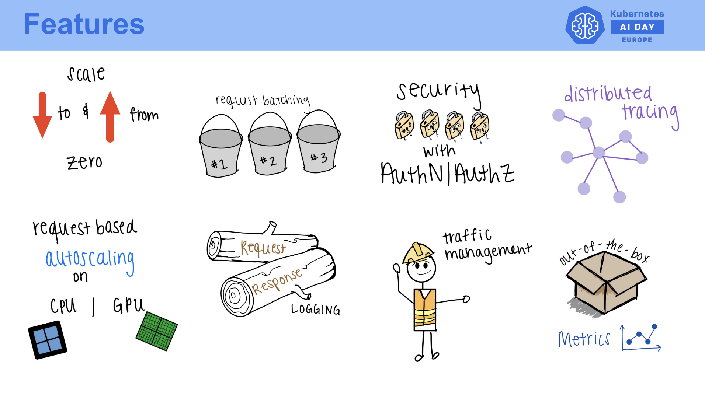

# **Introduction to KServe and Kubernetes**

## KServe and Kubernetes

This ReadMe will walk you through the basics of **KServe**, its integration with **Kubernetes**, and how to set up a Kubernetes cluster using **Google Cloud Platform (GCP)**. By the end of this guide, you will have a better understanding of these technologies, including how to install and use them.

### **What is Kubernetes?**
Kubernetes (K8s) is an open-source platform that automates the deployment, scaling, and management of containerized applications. Containers bundle applications and all their dependencies into isolated environments, ensuring they run consistently across different computing environments.

Kubernetes provides:
- **Automatic scaling:** It can automatically adjust the number of running container instances based on demand.
- **Self-healing:** It restarts or replaces containers that fail.
- **Load balancing:** It ensures network traffic is distributed across all instances of a service.
- **Service discovery and networking:** It assigns containers unique IP addresses and a DNS name, simplifying how applications communicate within the cluster.

### **What is KServe?**
**KServe** is an open-source platform that simplifies deploying and serving machine learning models in production on Kubernetes. It supports models trained with popular frameworks like **TensorFlow**, **PyTorch**, and **Scikit-learn**. KServe manages the entire model lifecycle, from deployment and versioning to scaling and routing traffic.

## **Overview of KServe**

KServe helps data scientists and engineers by simplifying the deployment and serving of machine learning models, making the process much more efficient. You don’t need to worry about manually handling scaling, monitoring, or traffic routing—KServe handles it for you.

Here are some key features of KServe:
- **Standardized model interface:** It provides a unified way to serve models from different machine learning frameworks.
- **Autoscaling:** KServe can automatically scale up or down based on the traffic load.
- **Model versioning:** You can manage multiple versions of the same model and route a portion of traffic to different versions.
- **Traffic splitting:** KServe allows for a controlled rollout of models by directing traffic between different versions (canary releases).
- **Integration with Knative and Istio:** These tools provide KServe with scaling, networking, and routing capabilities.

### **Model Lifecycle in KServe**
KServe manages the entire lifecycle of model serving, which includes:
- **Model Deployment:** Once your model is trained, KServe simplifies the process of deploying it on Kubernetes.
- **Scaling:** Based on the traffic or demand, KServe automatically adjusts the number of running containers for your model.
- **Traffic Routing:** It intelligently routes requests to different versions of your model, allowing you to test and roll out new versions.
- **Monitoring and Logging:** KServe integrates with logging and monitoring systems to track model performance and detect issues.

---

## **How KServe Integrates with Kubernetes**

KServe is built on top of Kubernetes, leveraging its robust capabilities for container management. Here's how KServe integrates with Kubernetes:

- **InferenceServices:** KServe introduces a concept called **InferenceService**, a Kubernetes Custom Resource Definition (CRD). CRDs extend Kubernetes' default capabilities, allowing you to manage new types of resources. InferenceServices define how models are served in Kubernetes.
- **Autoscaling via Knative:** KServe integrates with **Knative**, an extension to Kubernetes that automatically scales your models based on demand.
- **Networking and Routing with Istio:** KServe uses **Istio**, a service mesh tool, to manage the traffic flow between model versions, ensuring that requests are routed correctly even as you roll out updates.

By leveraging these tools, KServe makes it easy to deploy, manage, and scale machine learning models, abstracting away much of the complexity of managing Kubernetes directly.

---